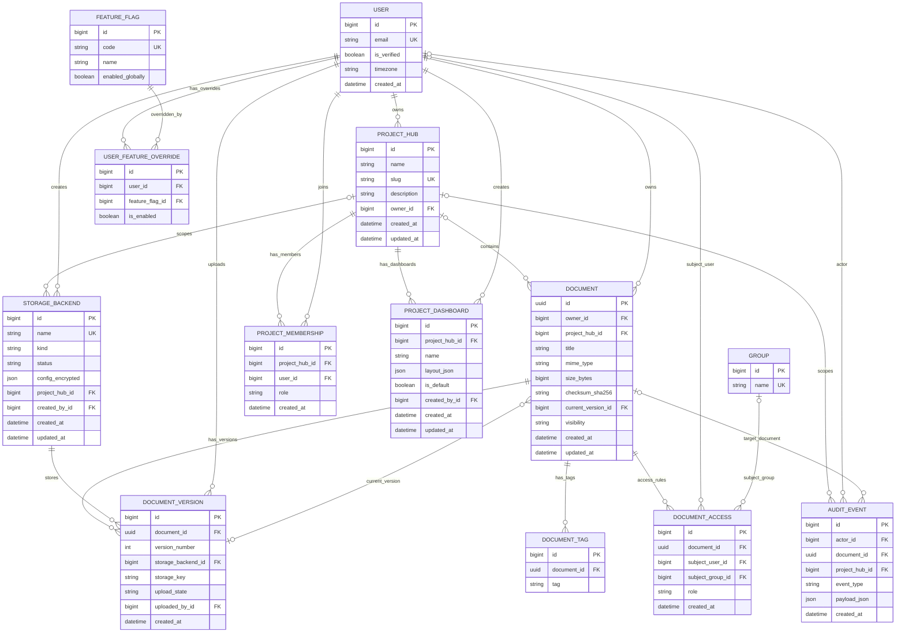

## Entity Relationship

Notes:
- `DOCUMENT.current_version_id` points to one selected row in `DOCUMENT_VERSION` (nullable).
- `DOCUMENT_VERSION` enforces unique `(document_id, version_number)`.
- `DOCUMENT_ACCESS` enforces exactly one subject: `subject_user_id` XOR `subject_group_id`.
- `USER_FEATURE_OVERRIDE` enforces unique `(user_id, feature_flag_id)`.
